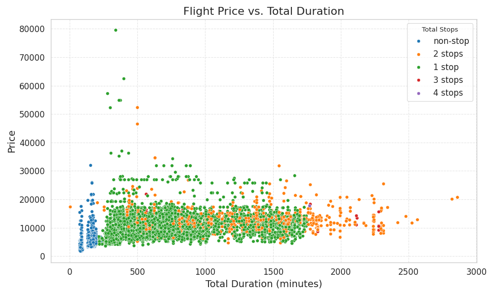
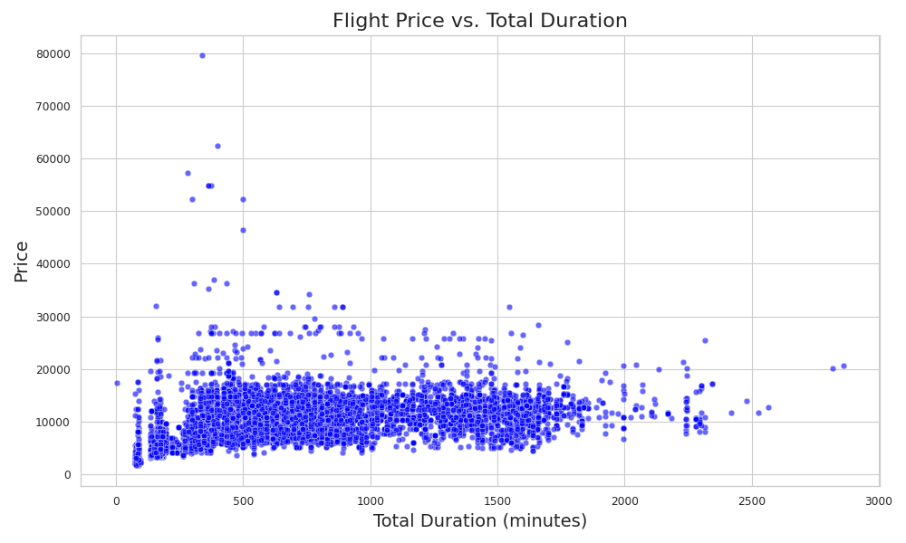
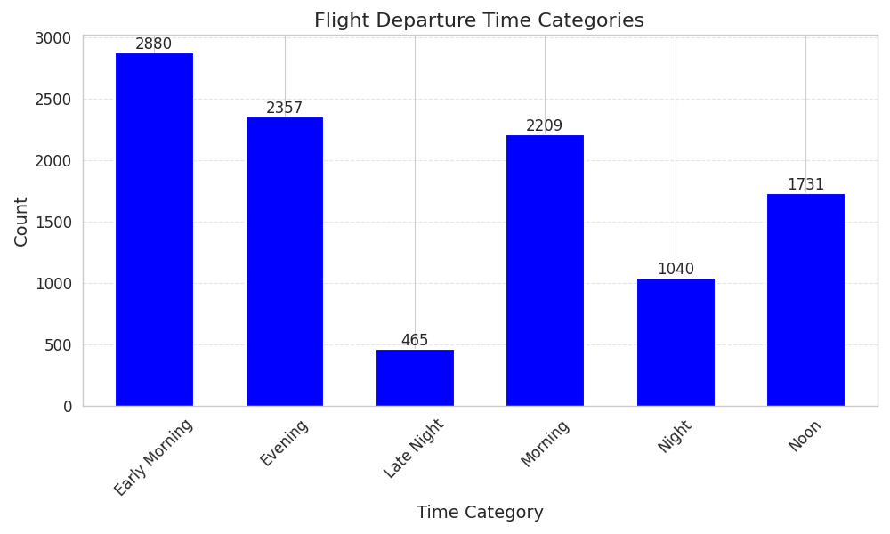

# Predicting Fare of Airlines Tickets using Machine Learning

## Overview

This project aims to predict the fare of airline tickets using machine learning techniques. The dataset contains various features such as the date of the journey, departure time, arrival time, duration, airline, source, destination, number of stops, and price. By analyzing these features and building a machine learning model, we can predict the fare of airline tickets accurately.

## Dataset

The dataset used in this project is provided in the following files:
- `Data_Train.xlsx`: Training dataset containing information about airline tickets.
- `Test_set.xlsx`: Test dataset for evaluating the trained model.

## Files

The following files are included in this repository:
- `Predicting_Fare_of_Airlines_Tickets_using_Machine_Learning.ipynb`: Jupyter Notebook containing the code for data preprocessing, exploratory data analysis, feature engineering, model building, and evaluation.
- `rf_random.pkl`: Serialized trained machine learning model (RandomForestRegressor) saved as a pickle file.
- `Flight Price vs. Duration Categories`: Visualization showing the relationship between flight price and duration categories.

- `Flight Price vs. Duration`: Visualization showing the relationship between flight price and duration categories.

- `Flight Departure Time Categories`: Bar plot displaying flight departure time categories.

## Dependencies

- pandas
- numpy
- matplotlib
- seaborn
- scikit-learn

## Getting Started

To run the Jupyter Notebook locally, follow these steps:
1. Clone this repository to your local machine.
2. Install the necessary dependencies using `pip install pandas numpy matplotlib seaborn scikit-learn`.
3. Open the Jupyter Notebook `Predicting_Fare_of_Airlines_Tickets_using_Machine_Learning.ipynb` and execute the cells.
4. Clone the repository `git clone https://github.com/ashaduzzaman-sarker/Predict-Fare-of-Airlines-Tickets-using-Machine-Learning.git`

## Results

The machine learning model achieved a high R-squared score and low Mean Absolute Percentage Error (MAPE), indicating good performance in predicting the fare of airline tickets.

## Future Work

- Deploy the trained model as a web application to allow users to predict the fare of airline tickets.
- Explore additional features or data sources to improve the model's predictive performance.
- Perform further analysis to understand the factors influencing the fare of airline tickets.

## Credits

This project was created by `Md. Ashaduzzaman Sarker`. Feel free to contact me at `ashaduzzaman2505@gmail.com` for any questions or feedback.

